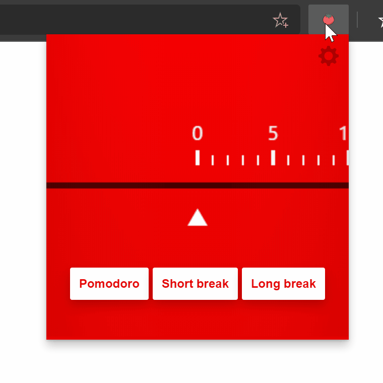

# Pomodoro Timer
An extension which implements the Pomodoro Technique, a time management method developed by Francesco Cirillo for Microsoft Edge.

# Features
- Quick template: Pomodoro;
- Quick template: Short break;
- Quick template: Long break;
- Drag and release on an arbitrary value to set the timer;
- Drag and release on 0 to stop the timer. 

# Privacy Policy
## Stored Data
No data is collected or stored by this extension except the extension settings which are synced across your devices using the browsers internal syncing capabilites (if it's activated). Data is not synced to a cloud service or to a third party local or remote application. 

## Browser permission 
Pomodoro Timer requires access to certain permissions from your browser. These permissions are carefully selected, and Pomodoro Timer would not function without these. The following permissions are required: 
- "storage"
To store extension settings
- "notifications"
To create and update notifications when a timer ends. 
- "<all_urls>"
To be able activate the extension whereever you are, this permission is required. 

## License
Please refer to the file named "LICENSE".

## Contact 
Please use Github to report/ask or discuss this web extension's features, questions about the privacy policy or other matters. 